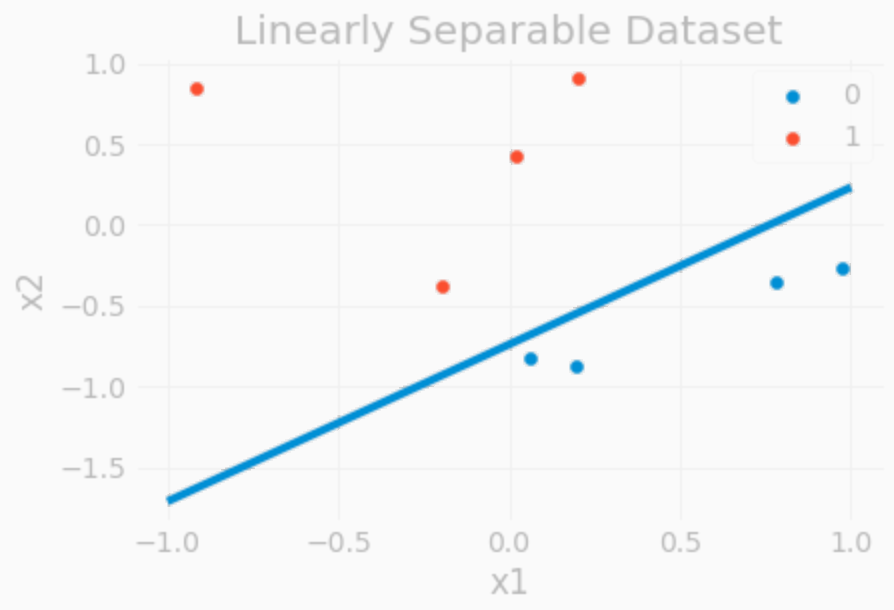

# Perceptron

The Perceptron model is one of the earliest and simplest attempt at modeling the neural structure of living beings. It was modeled after the mechanism of the binary nature of neurons firing whether a certain threshold was reached. This model was the groundwork that led the development of deep neural network that is so prevalent in today's machine learning. Pros of the Perceptron model include its low complexity and fast convergence to a minimum. However, because of the nature of the model, it is limited to being good at classifying only linearly separable data. 

## Code Implementation

The model was implemented by inheriting from Scikit-learn's `BaseEstimator` and `ClassifierMixin`. The `PerceptronClassifier` object learns from the provided data through its `.fit` method. For its purpose, it is almost always best to initialize the weights to be all zeros. The weights are updated after each instance of data by following the update rule given by:

$$
\Delta w = \lambda (y - \hat{y}) x_i
$$
$$
w \leftarrow w + \Delta w
$$

where $w$ is the weight, $\lambda$ is the learning rate, $y$ is the target value (either $0$ or $1$) $\hat{y}$ is the output from the model, and $x_i$ is the current training instance. 

Coming up with the stopping criteria can be tricky with Perceptron because of the binary nature of its outputs. Generally, we would want to stop training when there is no significant change to the weights from the training data, but with the Perceptron model, it is possible to go through large amounts of data with minimal change to the weights because of how the data is arranged or shuffled without reaching a good convergence point. Hence, I took the approach of saving the past 5 changes of weights after each epoch through the training data and comparing the 2-norm of this value with a certain $\epsilon$ value, where $\epsilon$ is proportional to the learning rate and 
a scale of the input data. There is a constant value $t_{max}$ which forces the model to stop training if the number of iterations surpass this point. This can be summarized as:

  $s = \underset{1 \leq j \leq n}{\max} \frac{1}{n}\Sigma_i |x_{ij}|$

  $\epsilon = \lambda s$

  STOP if $\lVert\delta\lVert_2 < \epsilon$

  OR $t > t_{max}$

where $\delta$ represents a vector containing the past 5 changes of weights, and $t$ is the current number of iterations.

## Debug and Evaluation Datasets

The `.arff` files were imported using Scipy. After deterministically training through the debug dataset 10 times, I was able to obtain the same weights and accuracy as the one posted. By solving for the equation of the line $x_2 = \frac{-w_1}{w_2}x_1 - \frac{b}{w_2}$ we can show the separating hyperplane with the data. 

  
  

Following the same process, the weights and the accuracy obtained for the evaluation dataset are as follows:

Final Weights = $\[-3.80657242, -2.840821, -3.0719334, -1.4003906, 4.9\]$

Accuracy = $0.99$

## Linearly Separable and Non-separable Datasets

Both linearly separable and non-separable datasets were created by randomly drawing 8 points from the uniform distribution in the unit box $`[-1, 1] \times [-1, 1]`$. The target value was then chosen to satisfy separability. These datasets are then saved as `.arff` files. Below are the two generated datasets:

<table align="center" border="1">
  <thead>
    <tr>
      <th colspan="3">Linearly Separable</th>
      <th colspan="3">Linearly Non-separable</th>
    </tr>
    <tr>
      <th>$x_1$</th>
      <th>$x_2$</th>
      <th>target</th>
      <th>$x_1$</th>
      <th>$x_2$</th>
      <th>target</th>
    </tr>
  </thead>
  <tbody>
    <tr>
      <th>$0.19741597$</th>
      <th>$-0.87408212$</th>
      <th>$0$</th>
      <th>$-0.09198194$</th>
      <th>$0.0981303$</th>
      <th>$0$</th>
    </tr>
    <tr>
      <th>$0.77847305$</th>
      <th>$-0.35361788$</th>
      <th>$0$</th>
      <th>$0.93617818$</th>
      <th>$-0.13420586$</th>
      <th>$0$</th>
    </tr>
    <tr>
      <th>$0.97622759$</th>
      <th>$-0.27068389$</th>
      <th>$0$</th>
      <th>$0.02919202$</th>
      <th>$-0.0764347$</th>
      <th>$0$</th>
    </tr>
    <tr>
      <th>$0.05865783$</th>
      <th>$-0.82223101$</th>
      <th>$0$</th>
      <th>$-0.87609183$</th>
      <th>$0.30259859$</th>
      <th>$0$</th>
    </tr>
    <tr>
      <th>$-0.19563794$</th>
      <th>$-0.3737767$</th>
      <th>$1$</th>
      <th>$-0.45058894$</th>
      <th>$0.40980197$</th>
      <th>$1$</th>
    </tr>
    <tr>
      <th>$0.01940362$</th>
      <th>$0.42199833$</th>
      <th>$1$</th>
      <th>$-0.01943979$</th>
      <th>$0.12687661$</th>
      <th>$1$</th>
    </tr>
    <tr>
      <th>$-0.91932312$</th>
      <th>$0.85053846$</th>
      <th>$1$</th>      
      <th>$-0.34174554$</th>
      <th>$-0.23565382$</th>
      <th>$1$</th>
    </tr>
    <tr>
      <th>$0.20271421$</th>
      <th>$0.90344603$</th>
      <th>$1$</th>     
      <th>$0.54322313$</th>
      <th>$0.22779957$</th>
      <th>$1$</th>
    </tr>
  </tbody>
</table>

## Training on the Data

Training on the linearly separable dataset converges quickly &mdash; after around 6 to 7 epochs with my convergence criteria &mdash; regardless of the learning rate. This is to be expected since if the initial weights are all 0, then the learning rate has no effect. To show this, let $w_{in}$ be the $i^{th}$ weight at $n^{th}$ training step. Then, $w_{i0} = 0$ for all $i$ and $w_{in} = \lambda^{n} \sum_{j=1}^{n} d_{ij}$ where $d_{ij}$ is the $`(y_j - \hat{y}_j)x_{ji}`$ value at some $j^{th}$ training step. Using the equation of a line shown above, $`x_2 = \frac{-w_1}{w_2}x_1 - \frac{b}{w_2}`$, we can see that $`\frac{-w_1}{w_2} = \frac{\lambda^{n} \sum_{j=1}^{n} d_{1j}}{\lambda^{n} \sum_{j=1}^{n} d_{2j}} = \frac{\sum_{j=1}^{n} d_{1j}}{\sum_{j=1}^{n} d_{2j}}`$ and similarly for the $`\frac{b}{w_2}`$ term, so we see that the learning rate $\lambda$ actually cancels out when searching for convergence. 

The same is true for the non-separable data, although it seems to never reach convergence. It always finishes training when $t_{max}$ is reached. Below are the plots showing each of the dataset with its respective separating line found by the Perceptron model:

    

## Voting Data

The voting data was randomly split into 70-30 training/testing datasets where the training set was used to train the perceptron model. The training set is shuffled before each epoch. After training, the test set was used to measure the accuracy of the model. The table below shows the result of 5 independent training on this data.

<table align="center">
  <thead align="left">
    <tr>
      <th></th>
      <th>Trial 1</th>
      <th>Trial 2</th>
      <th>Trial 3</th>
      <th>Trial 4</th>
      <th>Trial 5</th>
      <th>Average</th>
    </tr>
  </thead>
  <tbody align="left">
    <tr>
      <th># of epochs</th>
      <th>36</th>
      <th>31</th>
      <th>13</th>
      <th>20</th>
      <th>9</th>
      <th>21.8</th>
    </tr>
    <tr>
      <th>Accuracy (%)</th>
      <th>94.96</th>
      <th>94.96</th>
      <th>90.65</th>
      <th>96.40</th>
      <th>93.53</th>
      <th>94.10</th>
    </tr>
    <tr>
      <th>Final weights</th>
      <th>-0.1 -0.5 -0.8  1.7  0.5 -0.   0.3  0.6 -0.7  0.3 -0.9 -0.  -0.1 -0.2 -0.4  0.1 -0.9</th>
      <th>0.  -0.2 -0.4  1.6  0.4 -0.1  0.4  0.6 -0.7  0.2 -1.1  0.1  0.1  0. -0.1  0.4 -1.4</th>
      <th>-0.1 -0.4 -0.9  1.7  0.3 -0.5  0.4  0.1 -0.6  0.6 -0.4  0.2  0.2  0.4 -0.4  0.2 -0.7</th> 
      <th>-0.  -0.1 -0.8  1.6  0.2 -0.2  0.5  0.7 -0.5  0.4 -0.7  0.1  0.1 -0.1 -0.6  0.1 -0.9</th> 
      <th>-0.1 -0.2 -0.7  1.4 -0.2 -0.2  0.2  0.4 -0.4  0.3 -0.7  0.1  0.1 -0.1 -0.5  0.2 -0.6</th> 
      <th>-0.06 -0.28 -0.72  1.6   0.24 -0.2   0.36  0.48 -0.58  0.36 -0.76  0.1 0.08  0.   -0.4   0.2  -0.9</th>
    </tr>
  </tbody>
</table>

From these weights, we can see that the 4th attribute, which is physician-fee-freeze, the 11th attribute, immigration, and the 3rd attribute, adoption-of-the-budget-resolution, contributes the most towards a person’s political stance, while the 14th, 13th, and the 1st attribute &mdash; crime, superfund-right-to-sue, handicapped-infants &mdash; respectively contributes the least.

Below, we show the graph of average misclassification rate over epochs of training.

  

## Scikit-learn's Perceptron

We trained the same voting data using the Scikit-learn's Perceptron model. Since the train-test data are split randomly, the result isn't deterministic, but on average, it seems that Scikit-learn's model achieves an accuracy of 97%. I tried changing the L1 and L2 regularization terms and there doesn't seem to be an $\alpha$ value that consistently improves the accuracy. I also tried changing the $\eta$ parameter and it would always lower the accuracy. This is probably because the voting data is quite linear and doesn't need much regularization.

## Iris Dataset and Multiclass Perceptron

The Iris Dataset consists of 50 samples from each of three species of Iris (Iris Setosa, Iris virginica, and Iris versicolor). Four features were measured from each sample: the length and the width of the sepals and petals, in centimeters. The task is to predict the species using these four features. Because there are more than 2 classes for this task, the Perceptron classifier was modified to be able to handle multiple class. First, the number of weights equals the number of features (and bias) times the number of classes, so for this task, there were 15 weights in total. Each set of 5 weights tries to classify the input features to one of the 3 species. The predicted output is the class that is the highest value out of the 3 classes which is then one-hot encoded to be used to update the weights. The target values are also one-hot encoded as a 3-dimensional vector. The process can be summarized as:

$$\hat{y} = \underset{1 \leq j \leq 3}{\mathrm{argmax}} \hspace{1mm} Wx_i$$
    
$$\hat{y} \leftarrow \mathrm{one\_hot}(\hat{y})$$
    
$$\Delta W = \lambda (y - \hat{y}) \ast x_i$$
    
$$ W \leftarrow W + \Delta W $$

where $\ast$ operation behaves the way array broadcasting works in NumPy, so $(y - \hat{y}) \ast x_i$ results in a $3 \times 5$ matrix, the same shape as $W$. The resulting weights and accuracy of this task after doing a 70-30 train-test split are:

Final Weights =   $`\begin{bmatrix}
    1.83 & 3.9 & -5.25 & -2.73 & 0.9 \\
    2.15  & 0.25 & -1.29 & -3.55 & 1.8 \\
    -3.98 & -4.15 & 6.54 & 6.28 & -2.7
  \end{bmatrix}`$

Accuracy = $0.9556$
